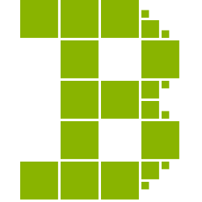
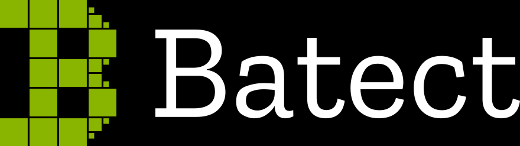
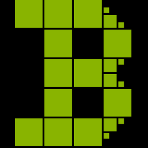
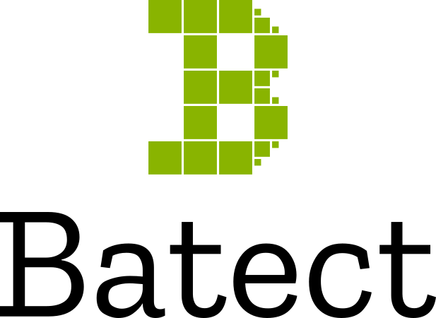

# The Batect logo

The Batect logo is a trademark of Charles Korn and may only be used subject to the following requirements:

* the logo must only be used in one of the forms provided in this repository
* the logo must be used unmodified (including but not limited to any modifications to colour, proportion or layout), but may be exported at a different resolution to the options provided here
* the logo must be used on a contrasting, solid background with a clear margin of 50% of the height of the green B icon on all sides
* the usage does not suggest or imply endorsement by, affiliation with, or any other form of connection to, the Batect project, its contributors or Charles Korn

Any permission to use the logo under these guidelines can be revoked at any time and for any reason.

Any use that does not meet these guidelines requires explicit written permission from Charles Korn.

## Which version should I use?

In general, you should use the files from the `optimised` directory. This directory contains PNG and optimised SVG versions suitable for a variety of use cases.

There are three layout variations and three background colour choices:

| Background  | Horizontal                                                  | Vertical                                                | Icon                                            |
| ----------- | ----------------------------------------------------------- | ------------------------------------------------------- | ----------------------------------------------- |
| White       |  |  |  |
| Black       |  |  |  |
| Transparent |  |  |  |

## Colour reference

Batect green: #89B400
